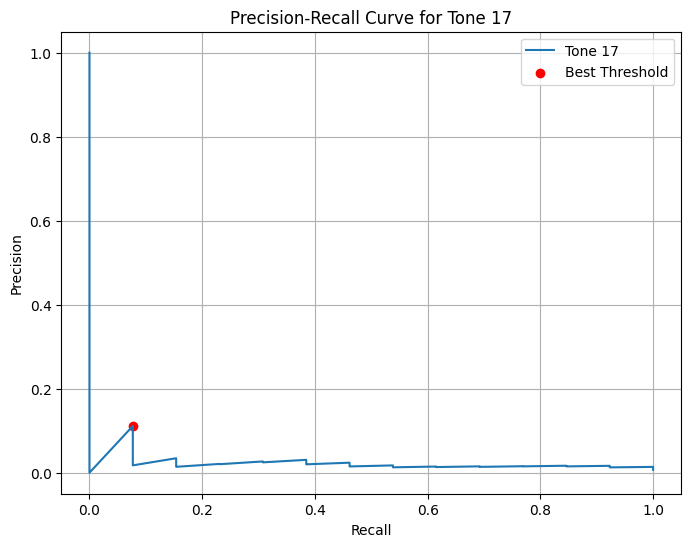
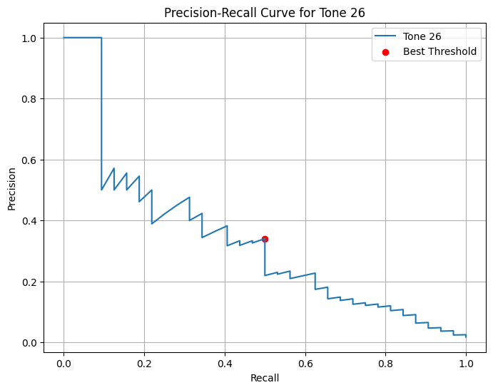
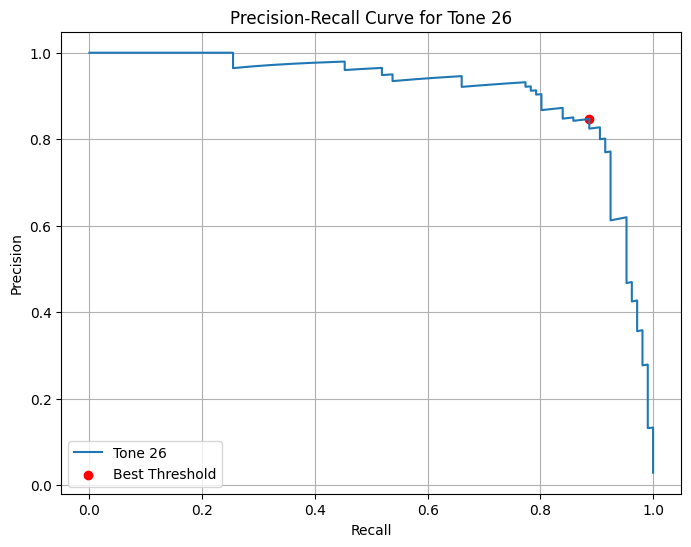
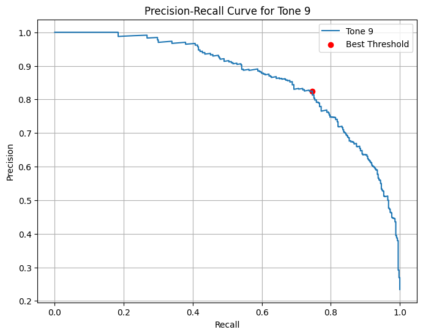
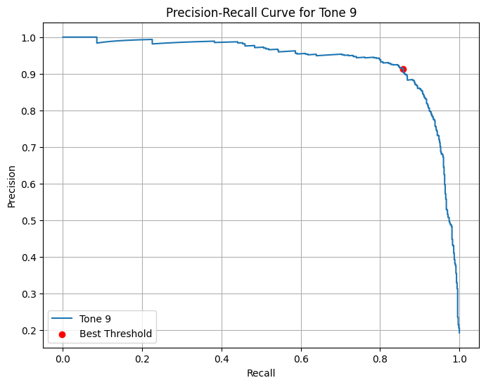
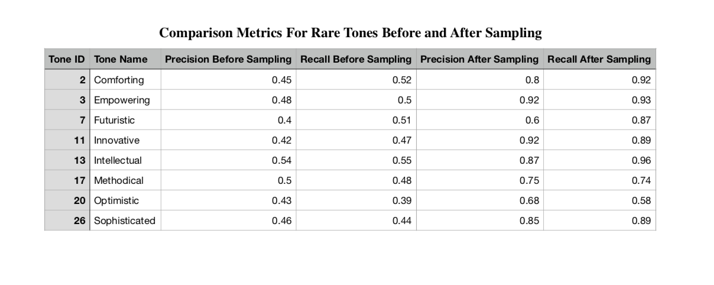
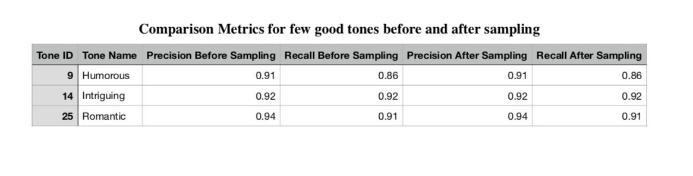

### **Getting Started:**

1. **Set up the environment and install dependencies:**  pip install -r requirements.txt

2. a) **To train the model:**  python scripts/train.py

   b) **To validate the model:**  python scripts/validate.py

# Fine-tuning Roberta for Emotional Tone Prediction using GPT-4o-mini as a teacher
An LLM-based approach to classify emotional tones in movie descriptions

### **Introduction**

This project uses machine learning and deep learning with large language models (LLMs) to classify emotional tones in movie descriptions.

Using the Movies Dataset from Kaggle, 15,000 movie overviews were labeled with emotional tones by the GPT-4o-mini API (teacher model). 

These labels were used to fine-tune a pre-trained RoBERTa model (student model) for multi-label classification. Class imbalance,

particularly for rare tones with low AUC in PR curves, was addressed through sampling with replacement, significantly improving precision,

recall, and F1-scores. This highlights the effectiveness of handling class imbalance in multi-label classification.**Features**

**Teacher-Student Distillation:**

* **Teacher Model:** GPT-4o-mini generated up to four emotional tone labels for each movie overview.
  
* **Student Model:** A pre-trained RoBERTa model was fine-tuned on the labeled dataset for tone classification.
  
Teacher-student distillation enabled labeling of an otherwise unlabeled dataset, reducing manual effort while enabling robust training.
 
 **Improved Metrics:** Enhanced performance metrics (precision, recall, F1-score) through dataset augmentation 

### **Emotional Tones**

The project classifies movies into the following 29 emotional tones:

Humorous, Inspiring, Heartwarming, Bittersweet, Euphoric, Melancholic, Tense, Romantic, Nostalgic, Intriguing, Comforting, Provocative, Empowering, Profound, Enchanting, Alarming, Perilous, Ominous, Fearless, Imaginative, Methodical, Investigative, Intellectual, Sophisticated, Innovative, Futuristic, Wholesome, Raw, Optimistic.

### **Dataset Details**

**Source:** The Movies Dataset on Kaggle

**Chosen File:** movies_metadata.csv

**Features Used:** original_title, overview

**Dataset Size:** 15,000 movies

**Generated Labels:** 29 emotional tones, including Humorous, Inspiring, Nostalgic, and more.

### **Training:**

Training used a multi-label binary classification approach.

**Loss Function Used:** Binary Cross-Entropy with Logits Loss (BCEWithLogitsLoss).

**Optimizer Used:** Adam Optimizer.

**Threshold:** 0.5

**Hyperparameters:**

**Learning Rate: 2e-5**

**Batch Size:** 16

**Number of Epochs:** 3

The training process is implemented in the train_model function, available in the train.py file located in the scripts folder.

#### ** Loss and Accuracy during training With Sampling:**

**Training Results without using Sampling with replacement:**

**Training Results using Sampling with replacement:**

**Evaluation Metrics:**

* The validation is done on test dataset by calling the validate method in validate.py in scripts

**Comparision of test metrics before and after Sampling**

From the test metrics, although the accuracy was high before sampling, precision, recall, and F1-score were significantly lower. Sampling

with replacement improved these metrics, increasing the F1-score from 0.6628 to 0.876.

### **Precision-Recall (PR) Curves:**

We plotted PR curves for each of the 29 tones. Frequent tones like humorous, romantic, and intriguing show better AUCs compared to rare 

tones like comforting, innovative, and intellectual. Sampling with replacement improved the PR curves of rare tones significantly.

Rare tones sampled: Tone IDs [ 2, 3, 7, 11, 13, 17, 20, 16]

The below are pr curves for few of the rare tones before and after sampling:

### **PR Curve for Rare Tone 2 (Comforting)**

| **Before Sampling**                                   | **After Sampling**                                    |
|-------------------------------------------------------|------------------------------------------------------|
|  |  |

### **PR Curve for Rare Tone 11 (Innovative)**

| **Before Sampling**                                   | **After Sampling**                                    |
|-------------------------------------------------------|------------------------------------------------------|
|  |  |

### **PR Curve for Rare Tone 17 (Intellectual)**

| **Before Sampling**                                   | **After Sampling**                                    |
|-------------------------------------------------------|------------------------------------------------------|
|  |  |

### **PR Curve for Rare Tone 26 (Sophisticated)**

| **Before Sampling**                                   | **After Sampling**                                    |
|-------------------------------------------------------|------------------------------------------------------|
|  |  |

So from the above pr curves we can seee for the less frequent tones we have lower Area under curve so we have

identified eight of these rare tones and done sampling with replacement for these rare tones.

### **PR Curve for frequent Tone 9 (humuorous)**
| **Before Sampling**                                   | **After Sampling**                                    |
|-------------------------------------------------------|------------------------------------------------------|
|  |  |

From the table, we can say that, sampling with replacement has improved the precision, recall and overall performance of rare tones. 

### **Conclusion:**

Overall, by identifying rare tones and augmenting the dataset, the F1-score increased from 0.6628 to 0.876, with notable improvements in precision and recall for rare tones. PR curves highlight how this approach effectively addressed class imbalance, benefiting rare tones while maintaining stable performance for frequent tones.
