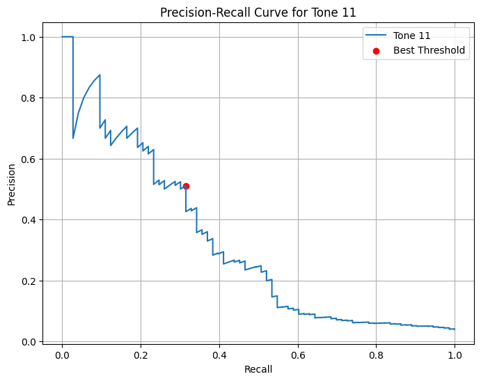

# Fine-tuning Roberta for Emotional Tone Prediction using GPT-4o as a teacher
An LLM-based approach to classify emotional tones in movie descriptions

### **Introduction**

This project explores the use of machine learning and deep learning, leveraging large language models (LLMs) to classify emotional tones in movie descriptions. The dataset is derived from The Movies Dataset on Kaggle, specifically the movies_metadata.csv file. Only the original_title and overview fields from 15,000 movies were used.

Using the GPT-4o-mini API as the teacher, emotional tone labels were generated for the movie overviews. These labels served as training data for fine-tuning a pre-trained student model, RoBERTa, to perform multi-label classification.

Class imbalance in the dataset, especially among rare emotional tones, was identified using precision-recall (PR) curves. Rare tones, which showed low AUC in the PR curves, were addressed using sampling with replacement to augment the dataset. This approach significantly improved precision, recall, and F1-scores, demonstrating the effectiveness of handling class imbalance in multi-label classification tasks.

### **Features**

**Teacher-Student Distillation:**

* **Teacher Model:** GPT-4o-mini generated up to four emotional tone labels for each movie overview.
  
* **Student Model:** A pre-trained RoBERTa model was fine-tuned on the labeled dataset for tone classification.
  
Teacher-student distillation enabled labeling of an otherwise unlabeled dataset, reducing manual effort while enabling robust training.
 
 **Improved Metrics:** Enhanced performance metrics (precision, recall, F1-score) through dataset augmentation 

### **Emotional Tones**

The project classifies movies into the following 29 emotional tones:

Humorous, Inspiring, Heartwarming, Bittersweet, Euphoric, Melancholic, Tense, Romantic, Nostalgic, Intriguing, Comforting, Provocative, Empowering, Profound, Enchanting, Alarming, Perilous, Ominous, Fearless, Imaginative, Methodical, Investigative, Intellectual, Sophisticated, Innovative, Futuristic, Wholesome, Raw, Optimistic.

### **Dataset Details**

**Source:** The Movies Dataset on Kaggle

**Chosen File:** movies_metadata.csv

**Features Used:** original_title, overview

**Dataset Size:** 15,000 movies

**Generated Labels:** 29 emotional tones, including Humorous, Inspiring, Nostalgic, and more.

## **Training:**

Training used a multi-label binary classification approach.

**Loss Function Used:** Binary Cross-Entropy with Logits Loss (BCEWithLogitsLoss).

**Optimizer Used:** Adam Optimizer.

**Threshold:** 0.5

**Hyperparameters:**

**Learning Rate: 2e-5**

**Batch Size:** 16

**Number of Epochs:** 3

The training process is implemented in the train_model function, available in the train.py file located in the scripts folder.

#### ** Loss and Accuracy during training With Sampling:**

**Training Results without using Sampling with replacement:**

**Training Results using Sampling with replacement:**

**Evaluation Metrics:**

* The validation is done on test dataset by calling the validate method in validate.py in scripts

** Comaparision of test metrics before and after Sampling**

As we can see from the test metrics eventhough the accuracy we have achieved higher accuracy before sampling we can see that the precision,

recall, f1-score seems to be very low without sampling, the table show that sampling with replacement significantly improved all metrics, 

especially precision and recall, leading to an increased F1-score from 0.6628 to 0.876.

Precision-Recall (PR) Curves:
we have got pr curves for each of the 29 tones. Tones such as romantic, bittersweet, intriguing etc seems to be more frequent when compared

to tones such as ominous, futuristic seems to be less frequent, so for the less frequent tones we have lower Area under curve so we have

identified eight of these rare tones and done sampling with replacement for these rare tones

The below are pr curves for few of the rare tones before and after sampling:

### **PR Curve for Rare Tone 2 (Comforting)**

| **Before Sampling**                                   | **After Sampling**                                    |
|-------------------------------------------------------|------------------------------------------------------|
|  |  |

### **PR Curve for Rare Tone 11 (Innovative)**

| **Before Sampling**                                   | **After Sampling**                                    |
|-------------------------------------------------------|------------------------------------------------------|
|  |  |

